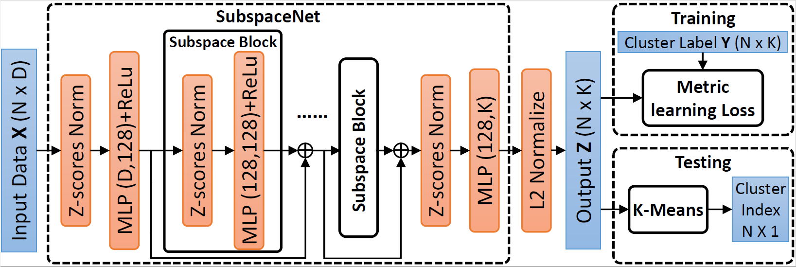

## Learning Clustering for Motion Segmentation
Created by <a href="http://xu-xun.com" target="_blank">Xun Xu</a>.

### Introduction
This work is based on the <a hred='https://arxiv.org/pdf/1904.02075.pdf'> ArXiv submission </a> [1]. We proposed a deep neural network based clustering framework to learned from labeled clustering dataset. Experiments are carried out on both rigid 3D motio segmentation and more challenging non-rigid motion segmentation benchmarks.

We currently released tensorflow code for experiments on KT3DMoSeg [2, 3] dataset and other datasets are coming soon. You are welcome to report any bugs you would identify. Should you have any concerns or experience any issues please raise in Issues so that all people can benefit from the discussions.

### Installation
This code has been tested on Pyhon3.6, TensorFlow1.14, CUDA 10.0, cuDNN 7.0 and Ubuntu 18.04

### Usage
You should first download the data for KT3MoSeg by running:

### Reference
[1] Xun Xu, Loong-Fah Cheong, and Zhuwen Li. "Learning for Multi-Type Subspace Clustering." ArXiv: 1904.02075, 2019

[2] Xun Xu, Loong-Fah Cheong, and Zhuwen Li. "Motion segmentation by exploiting complementary geometric models." Proceedings of the IEEE Conference on Computer Vision and Pattern Recognition. 2018.

[3] Xun Xu, Loong Fah Cheong, and Zhuwen Li. "3D Rigid Motion Segmentation with Mixed and Unknown Number of Models." IEEE Transactions on Pattern Analysis and Machine Intelligence (2019).